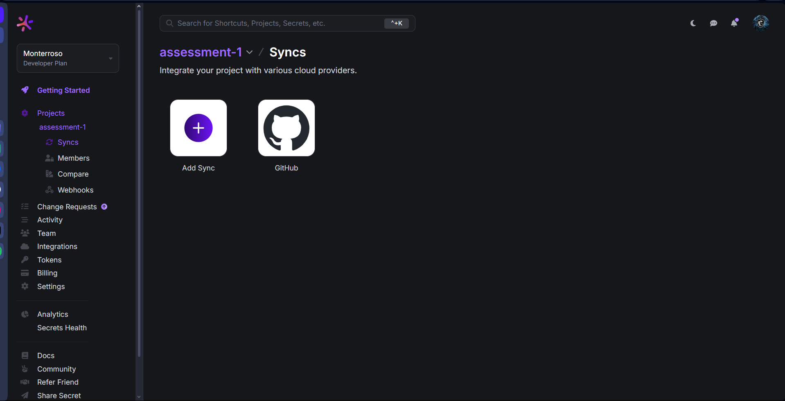
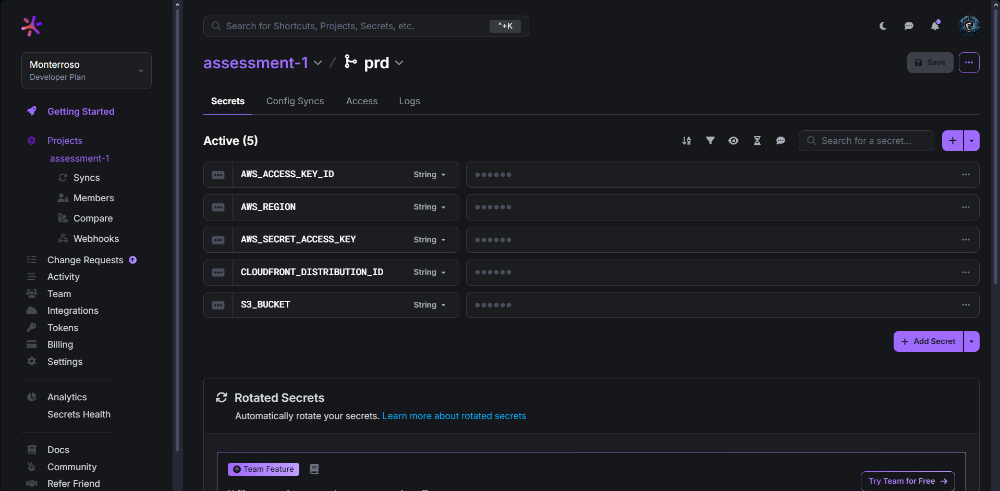
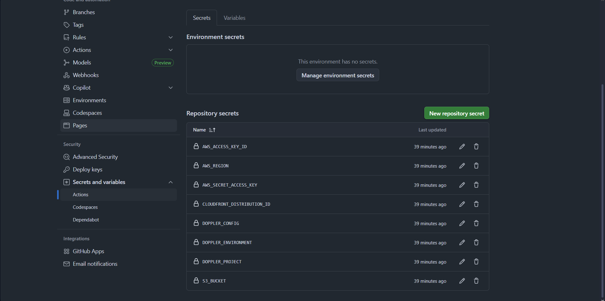
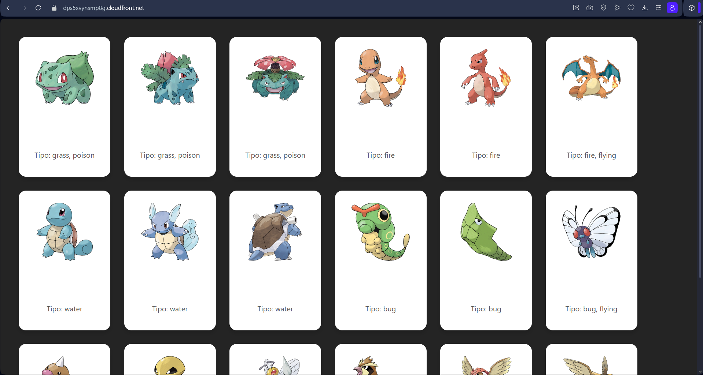

# Pokémon Gallery Deployment

This repository contains the Pokémon gallery web application deployed via AWS S3 and CloudFront. Below are the required evidences for the assessment.

---

## 📸 Config Syncs in Doppler

---

## 📸 Doppler Variables

---

## 📸 GitHub Secrets

---

## 📸 Pokémon Gallery Application

---

## 🌍 CDN URL
[Access the deployed app](dps5xvynsmp8g.cloudfront.net)
---
