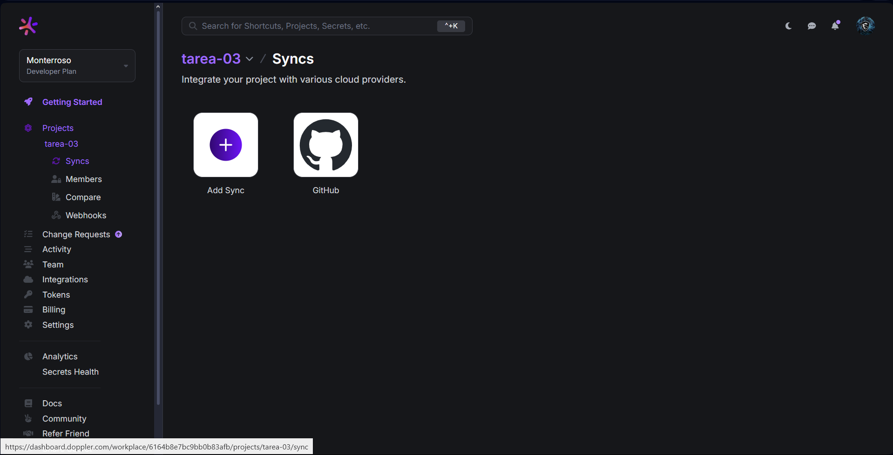
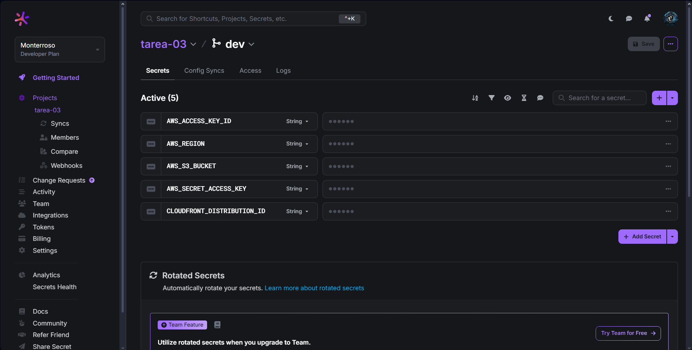
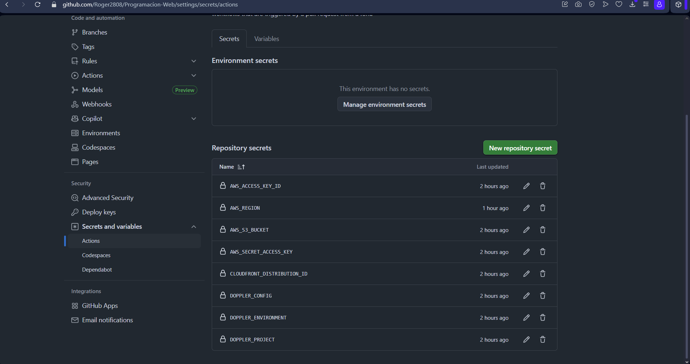

# Programacion-Web

# Tarea 3 - Deployment a CDN con Vite, Doppler y AWS CloudFront

Este proyecto contiene la configuración y despliegue de la Tarea 3, que incluye:
- Proyecto configurado con Vite
- Gestión de secretos con Doppler
- Pipeline en GitHub Actions para build y deploy a AWS S3 y CloudFront

## Evidencias

### Config Syncs en Doppler  

### Variables en Doppler  

### Secretos en GitHub Actions  

## URL del CDN (CloudFront)

https://doye2gyjmt7le.cloudfront.net
