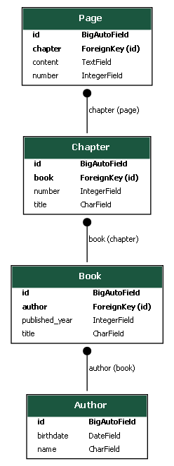

# Django API Deployment with Docker – Homework 6

## Overview

This project demonstrates how to deploy a **Django REST API** using **Docker** and **Docker Compose**, following best practices for lightweight images, dependency management, and service orchestration.

It is based on the previous task (**hw_05**) and includes:
- `Dockerfile` to build the Django image (non-root, lightweight).
- `docker-compose.yml` to run the app and PostgreSQL together.
- `.env` file with default credentials.
- Proper dependency setup and database initialization.


## Requirements

Before you begin, ensure you have installed:

- [Python 3.12+](https://www.python.org/downloads/)
- [Docker Desktop](https://www.docker.com/products/docker-desktop/)
- [Git](https://git-scm.com/downloads)

---


### Commands:

```bash
git checkout main
git pull origin main
git checkout -b hw-06
````

### Environment Variables:

Create a file named **`.env`** in the root of your project with the following content:

```env
POSTGRES_DB=postgres
POSTGRES_USER=postgres
POSTGRES_PASSWORD=postgres
DB_HOST=db
DB_PORT=5432
DEBUG=True
SECRET_KEY=django-insecure-1yt&%+@%6j%29b%9ez*n-+e=y2evk$tj9^1xxhw)@@co^29wno
```

## (Optional) Local Setup Without Docker

If you wish to test Django manually before using Docker, follow these steps.

Create a virtual environment:

```bash
python -m venv venv
```

Activate the environment:
**Windows PowerShell:**

```powershell
venv\Scripts\activate
```

**Linux / macOS:**

```bash
source venv/bin/activate
```

Install dependencies:

```bash
pip install -r requirements.txt
```

Apply migrations:

```bash
python manage.py migrate
```

Create superuser:

```bash
python manage.py createsuperuser
```

Run the development server:

```bash
python manage.py runserver
```

Then visit:

  - `http://localhost:8000`
  - `http://localhost:8000/admin`

## Docker Setup (Main Method)

This is the required setup for Homework 6.

### Build and start the containers

```bash
docker-compose up --build
```

If don't works:
```bash
docker-compose build --no-cache
docker-compose up
```

This command will:

  - Build the Django image using the `Dockerfile`.
  - Pull and run the PostgreSQL image.
  - Start both services automatically.

### Create a Django superuser (inside the container)

```bash
docker-compose exec web python manage.py createsuperuser
```

You’ll be prompted for:

  - Username: `admin`
  - Email address: `admin@example.com`
  - Password: `********`
  - Password (again): `********`

### Verify that everything works

Open your browser and check:

  - App: `http://localhost:8000`
  - Admin panel: `http://localhost:8000/admin`

Login using the credentials created above.

### Stopping all containers

When you’re done, stop everything safely:

```bash
docker-compose down
```

If you also want to remove all volumes (database data):

```bash
docker-compose down -v
```

## Example of Docker Commands

Build image manually

```bash
docker build -t django-app .
```

List images

```bash
docker images
```

Run container manually

```bash
docker run -p 8000:8000 django-app
```

Stop and remove containers

```bash
docker-compose down
```

## Testing Checklist

  - [ ] Docker builds successfully.
  - [ ] `docker-compose up --build` runs both Django and PostgreSQL.
  - [ ] `python manage.py migrate` works inside the container.
  - [ ] Admin page accessible at `http://localhost:8000/admin`.
  - [ ] `.env` file loaded correctly.


## Author

Name: Roger Monterroso
Course: Programación Web
Assignment: Homework 6 – Docker Deployment


## Diagrama de base de datos

### Diagrama final de relaciones


> El diagrama fue generado usando `django-extensions` y `graph_models`.

