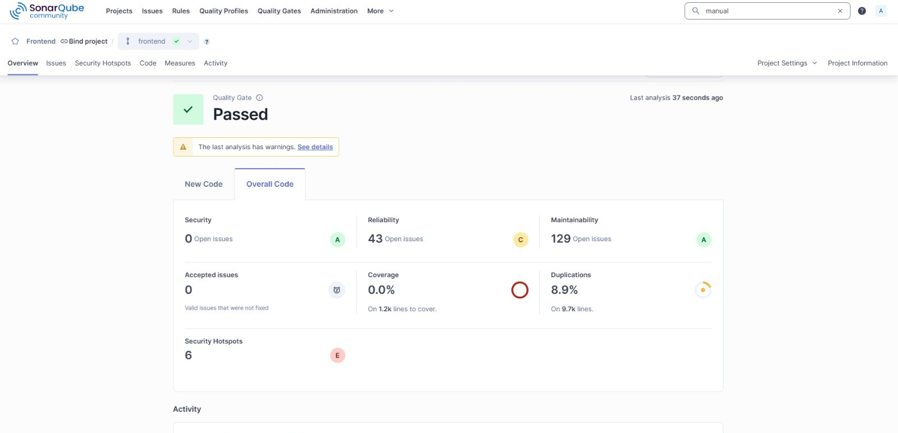
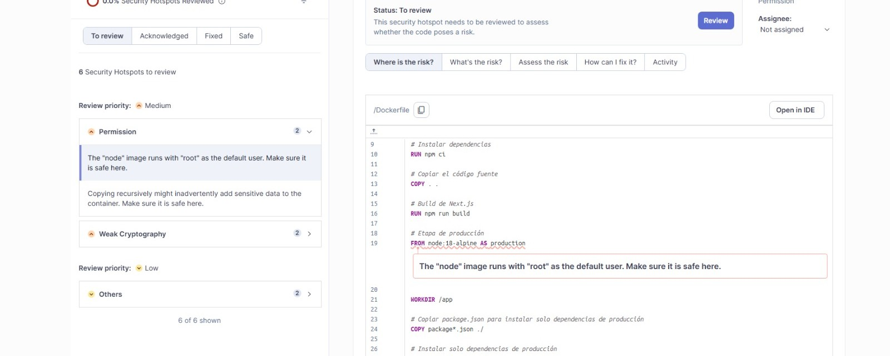
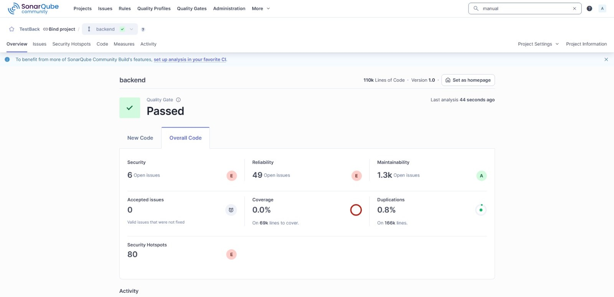
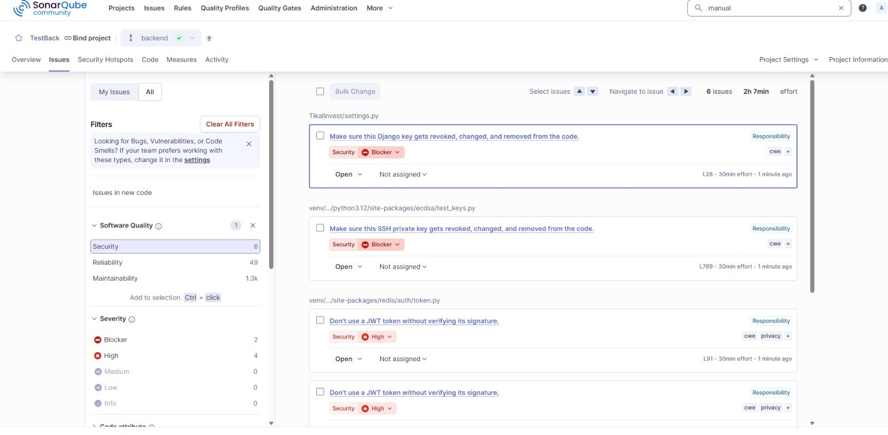

# Análisis con SonarQube

## Descripción
Este proyecto utiliza **SonarQube** desplegado con **Docker Compose** para analizar vulnerabilidades y buenas prácticas en el **frontend (Next.js + TypeScript)** y el **backend (Django + Python)**.

## Configuración
SonarQube fue levantado mediante el archivo `docker-compose.yml`, que contiene toda la configuración necesaria para realizar el análisis.

## Resultados del análisis

### Frontend
Se realizaron escaneos de seguridad y buenas prácticas sobre el frontend del proyecto.  
A continuación se muestran las capturas de las vulnerabilidades encontradas:

  

---

### Backend
También se realizaron escaneos de seguridad y buenas prácticas sobre el backend del proyecto.  
A continuación se muestran las capturas de las vulnerabilidades encontradas:

  

