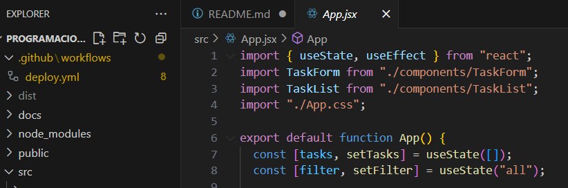
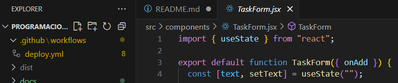
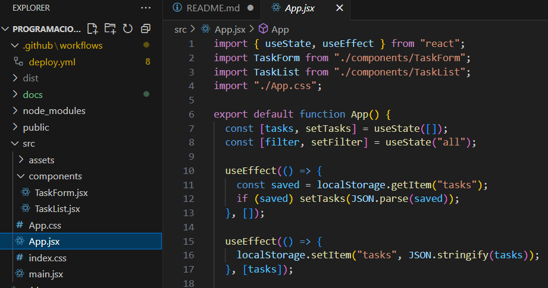

# Gestor de Tareas - HW-04

Esta aplicación permite crear, eliminar y marcar tareas como completadas, usando React.

## Hooks utilizados

## 1. **useState** en **App.jsx**

**Descripción:**  
Se utiliza para manejar el estado global de las tareas (**tasks**) y el filtro (**filter**).
**tasks** almacena la lista completa de tareas y **setTasks** permite actualizarla, provocando que la interfaz se renderice automáticamente cada vez que cambian las tareas.  
Esto permite que los componentes **TaskForm** y **TaskList** compartan y actualicen la lista de manera reactiva.

## 2. **useState** en **TaskForm.jsx**

**Descripción:**  
Se utiliza para manejar el estado local del input del formulario (**taskName**).
Permite que el valor del input se actualice mientras el usuario escribe y que se resetee cuando se agrega la tarea.  
Es un estado **temporal y local** al componente, necesario para la interacción del usuario con el formulario.

## 3. **useEffect** en **App.jsx**

**Descripción:**  
Se utiliza en dos casos:
1. Cargar las tareas desde **localStorage** cuando la aplicación inicia.
2. Guardar las tareas en **localStorage** cada vez que se modifican.

Esto garantiza que las tareas se mantengan aunque el usuario recargue la página, manteniendo persistencia en el navegador.

# Link del CDN
https://d34o80u9hnk4jq.cloudfront.net
